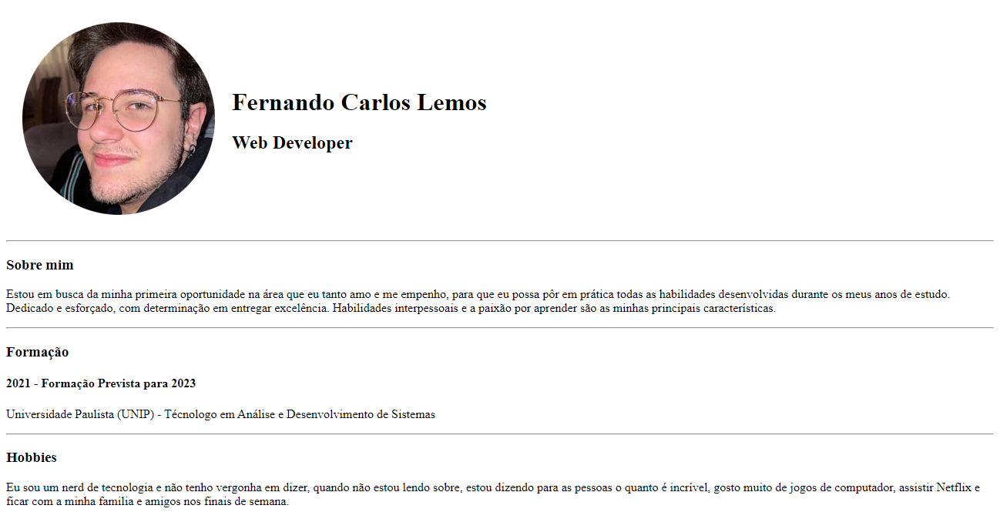

# Currículo feito apenas usando HTML segundo o aprendizado no Curso Web Development Bootcamp da Udemy.

Projeto criado para um currículo feito apenas usando HTML segundo o aprendizado no Curso Web Development Bootcamp da Udemy.

## 🛠 Tecnologias 

-HTML

-Git e Github

## 👋 Contato

febibilemos@gmail.com
